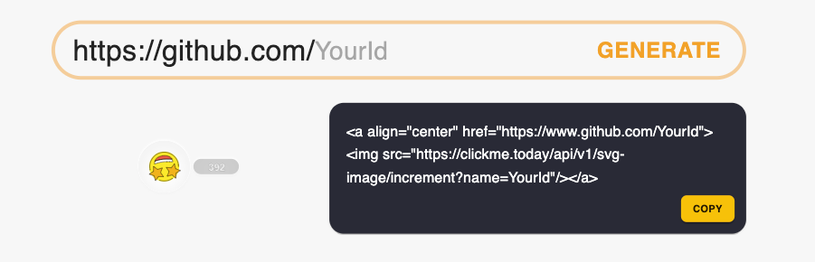

# CLICK-ME

[Generate Your Own ClickMe](https://clickme.today/main)
## Overview
[CLICK-ME](https://clickme.today/main) provides the SVG image presented emoji and total click count.

## How To Use
### How To Generate The Image
You generate the click-me through [site](https://clickme.today/main)  

## Features
+ Displays total click count on your page.
+ Support image with customize style.(comming soon..)
+ Provides rankings for github users.

## LICENSE
This project is licensed under  Creative Commons Share Alike License 4.0 ([CC BY-SA 4.0](https://creativecommons.org/licenses/by-sa/4.0/))
